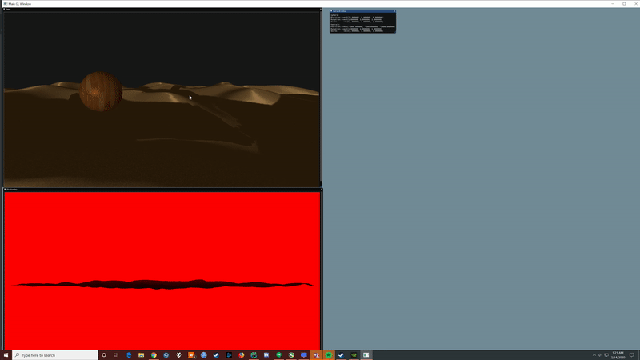

# GAME ENGINE [Name TBD]

This is a personal openGL rendering and eventually game engine project used to learn openGL. This engine has been 
build from the ground up, loosely on opengl and game engine tutorials, as well as some personal research.

## Author

* **Sean Webster**  - [WorldWideWebster](https://github.com/WorldWideWebster)

## License

This project is licensed under the MIT License - see the [LICENSE.md](LICENSE.md) file for details

## Progress:
2/14/2020 - Omnidirectional Shadows Working!

2/14/2020 - Directional Shadows Working!

## Acknowledgments
**OpenGL Tutorials:**

* **ThinMatrix (https://www.youtube.com/user/ThinMatrix)**
* **TheBennyBox (https://www.youtube.com/user/thebennybox)**
* **Joey de Vries (https://learnopengl.com/)**
* **Song Ho Ahn (http://www.songho.ca/)**

**Templates, ETC:**
* **Billie Thompson** - *[Readme Template](https://gist.github.com/PurpleBooth/109311bb0361f32d87a2#file-readme-template-md)* - [PurpleBooth](https://github.com/PurpleBooth)

**Special Thanks:**
* David Bedford - for helping me when I was first learning game dev (RIP)